## 1부 VR에 필요한 기능 탐방하기

- 1부 최종 결과물

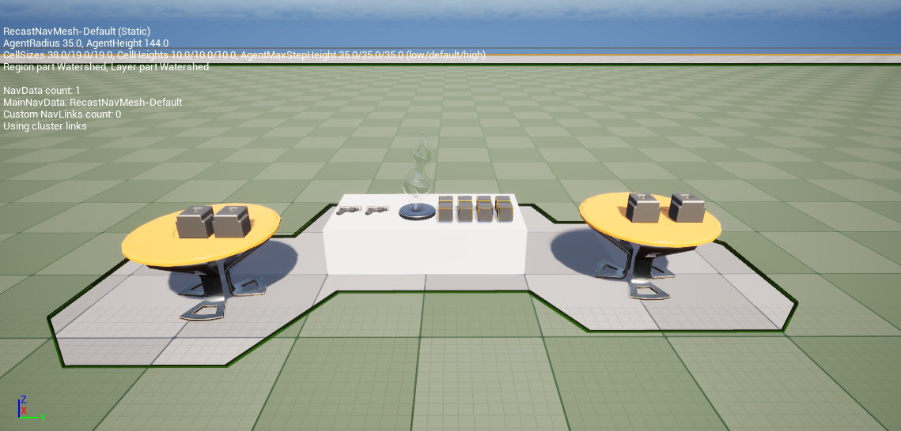

### 1. VR Template 탐방하기
 
- VR Template 들어가서 이것저것 파악해보기
- VRPawn [플레이어]
  - Begin Play 
    - Tracking Origin 
    - Head Mounted Display Enabled [머리 위치 및 컨트롤러 트래킹] [카메라의 높이를 조정하여 체험을 하는 값]
    - Key Input / IMC_Default [VR의 기본적인 움직임] , IMC_Hands [손 움직임]
  - 입력키
    - IA_Turn : 회전
    - IA_Move : 움직임
    - IA_Grab_Left/Right_Pressed
    - IA_Grab_Left/Right_Released
    - IA_Menu_Toggle_Left/Right
    - 4가지 입력 키 [ Grasp / IndexCurl / Point Point / ThumbUp]
    - Enhance로 키를 일력하는 방식 알아보기
  - 컴포넌트 탐색해보기
    - MotionControllerRight/LeftAim [상호작용을 위한 에임]
    - WidgetInteractionRight/Left [상호작용을 위한 에임 [UI 경로 보여주기]]
    - MotionControllerRight/Left Grip [모션컨트롤의 위치 및 애니메이션]
  - 함수 알아보기
    - 텔레포트를 담당하는 함수
    - 턴을 담당하는 함수
    - UI 로 전환하는 함수
    - 컨트롤러 근처에 있는 GrabComponent를 찾아내는 함수[이 친구를 통해 충돌 타입을 확인한다]
- GrabComponent [사물] 
  - Begin Play : 충돌시킨 사물 물리작용 설정하기
  - Grab / Release : 사물을 집고 떨어뜨리는 과정을 구현 
  - 왼쪽인지 오른쪽인지 알아보는 함수
  - Grab을 보면 Free / Snap 이 표현
  - 기본 사물 : Free
  - 총기 같은 물체 : Snap
- 언급만 하기 
  - Menu / Widget Menu

- 새로운 맵으로 넘어가기
  - 새로운 맵 하나 만들기
  - GameMode 설정하기
  - Floor - Collision - BlockAll로 변경하기
  - Direction Light - Stationary로 변경하기
  - NavMeshBoundsVolumes 설정하기 [30/30/3]

- 과제
  - 새로운 맵에서 VR 환경 조성해보기
  - VR에서 탐방할 맵들 [내부 X] 선정해서, 텔레포트로 맵을 탐방하는 맵을 구현해보자
  - 마켓플레이스 및 기타 맵으로 전환하여, VR 환경을 조성해봅시다.

### 2. 캐릭터 움직임 및 GrabComponent를 통해, 사물 던지기 동적으로 바꾸기

- Enhance 에 대하여 탐구해보기 
  - 캐릭터를 움직여보자
  - VR Template에서 Input Action 을 하나 제작한다.
  - IA_Controller_Move [IMC_Default - Thumbstick Left (Y)]
  - !!![카메라 방향으로 가는 것은 연구가 필요할듯 함].

- GrabComponent를 확장시켜보자.
  - 사물을 던졌을 때, 움직임이 생각보다 매끄럽지 않는다는 것을 볼 수있다.
  - 자연스럽게, 던져졌을 때의 물리 값을 저장하여, 매끄럽게 던져보자
  - 몇 프레임동안 손동작으로 사물을 움직이는 것을 저장해, 목표지점을 예측하여 던지게 하는 방식식
  - Tick에서 사물의 값을 저장한다.
  - Component Tick 활성화 체크
  - 4개의 변수
    - LastFrameLocation(Vector)       : 위치 사이를 결정
    - LastFrameForwardVector(Vector)  : 회전 차이를 확인
    - LinearVelocities(Vector:Array)  : 프레임 저장하기
    - AngularVelocities(Vector:Array) : 각도 저장하기
  - Begin Play에 초기값 저장하기
  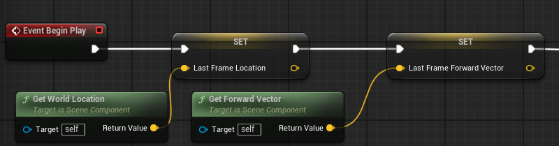
    - LastFrameLocation : Get World Location
    - LastFrameForwardVector : Get Forward Vector
  - Event Tick 설정하기
  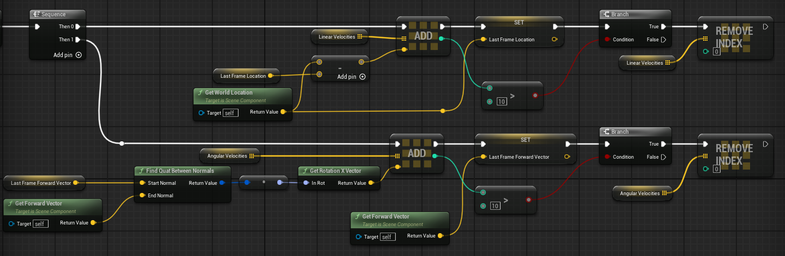
  
    - Sequence 1 : 
      - [LastFrameLocation - Get World Location]
      - [Linear Velocities 에 Add 이후 LastFrameLocation 에 추가하기]\
      - [Linear Velocities 10개 넘으면 0번 인덱스 삭제]
    - Sequence 2 : 
      - [LastFrameForwardVector / GetForwardVector - Find Quat Between Normals] - Get Rotation X Vector]
      - [AngularVelocities  에 Add 이후 Get Forward Vector LastFrameForwardVector에 넣기]
      - [AngularVelocities 10개 넘어가면 0번 인덱스 삭제]
  - 평균 구하는 GetAverageVector 함수 만들어보기 [Pure 사용방법 익히기]
  - SetPrimitiveCompPhysics 함수 물리 작용 추가하기
  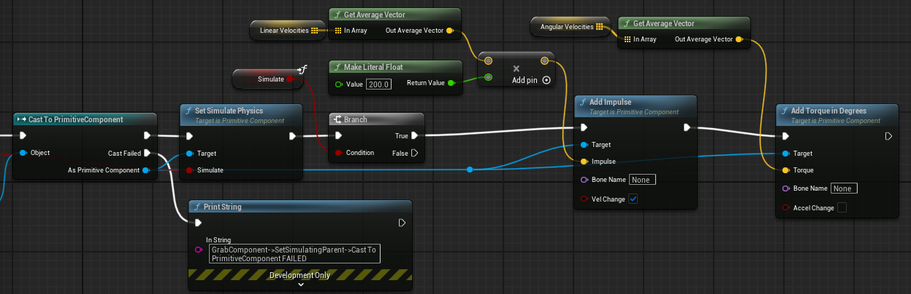
    - Simulate - Branch
    - Linear Velocities 평균 * 파워 [Add Impulse]
    - Angular Velocities - Add Torque in Degress [회전 설정하기]

### 3. 소켓을 이용한 손동작 애니메이션 추가하기

- Anim 설정을 위한 애니메이션 추가하기
  - Chararcters - MannequinsXR - Mesh 에서 ABP_MannequinsXR 관리하기 [한번씩 들어가보기]
    - Idle
    - Grasp
    - Point Right
    - ThumbUp Right
    - Index Curl
    - VR Pawn 에서 입력상태에 따라 확인하기
  - ALI_VR_Hand_Interface
    - Idle 에 4가지 동작 세팅 완료하기 [Idle / Grasp / Point / ThumbUp]
    - ABP_MannequinsXR 인터페이스 적용하여, 부품화 하기
  - ABP_VR_Hand_Pistol 구성하기
    - Grasp / ThumbUp - Layer로 구성하기
    - IndexCurl - Clamp 로 구성하기 - Output 연결하기
    - VR Pawn에 Pistol 그랩했을 때, 숨기기 기능 해제하기
    - VR Pawn에 Pistol 의 Shoot Right/Left IndexCurl과 연결하기
- 소켓 구성하기
  - FPWeapon - SM_Pistol - Convert To Skeletal Mesh 설정해주기
  - SKM_Pistol에 Physics Asset 만들어주기 / Box로 전환
  - Socket GripPoint 만들어주기
  - Socket GripPoint에 손 위치 잡아주기
- GrabComponent 세팅하기
  - 변수 세팅
    - 만든 2개를 설정하는 변수 세팅하기
      - HandAnimLayer : AnimInstance(Class)
      - HandSocket : Name
    - 손 모양새를 보여줄지 안보여줄지를 설정하는 핸드
      - bCaptureHand : boolean
    - 손을 놓았을 때 손이 원래 위치로 돌아가도록 하는 손의 위치값 캐쉬
      - CachedHandLocationTransform
  - 함수 세팅
    - TryFindHandMeshOnController
      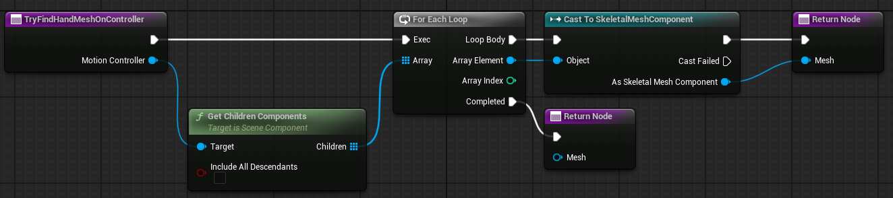
      - Input [MotionController : Motion Controller Component]
      - Output [Mesh : Skeletal Mesh Component]
      - MotionController의 자식들중에서 Mesh 가져오기 : Get Children Components
      - For Each 문으로 SkeletalMeshComponent찾아서 Mesh로 반환하기
    - TryCaptureHandMesh
      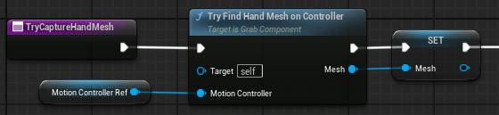
      - MotionControllerRef를 TryFindHandMeshOnController에 연결하여 찾은 Mesh , 변수 Mesh에 세팅하기
        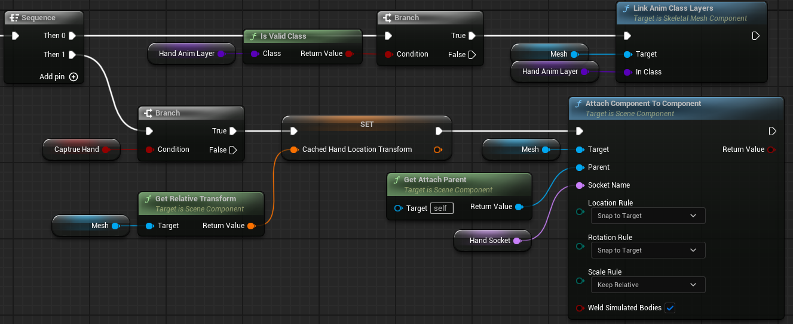
      - Sequence 1 : 애니메메이션 링크 연결해주기
        - HandAnimLayer 
        - IsValidClass 
        - Branch 
        - LinkAnimClassLayers
      - Sequence 2 : 위치값 저장하기, 컴포넌트 연결해주기
        - CaptureHand 
        - Mesh - Get Relative Transform : Cached Hand Location Transform 에 넣어주기
        - Attach Component To Component 연결해주기
        - Mesh / Get Attach Parent
        - HandSocket
        - Sanp to Target / Snap To Target / Keep Relative
    - TryReleaseHandMesh
        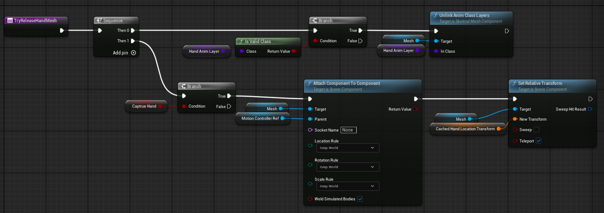
      - Sequence 1 : 애니메이션 링크 풀어주기
        - HandAnimLayer - IsValidClass - Branch - Unlink Anim Class Layers
      - Sequence 2 : 
        - CaptureHand - Attach Component To Component [Mesh / Motion Contorller Ref] 
        - Keep World / Keep World / Keep World
        - 위치값 돌려놓기
  - 객체 설정
    - 피스톨의 Static Mesh - Skeletal Mesh 로 전환
    - GrabComponentSnap 에서 HandAnimLayer / HandSocket / Capture Hand 설정

- 왼손 설정하기
  - 왼손 버전 소켓 만들기 [GripPoint_Inverse]
  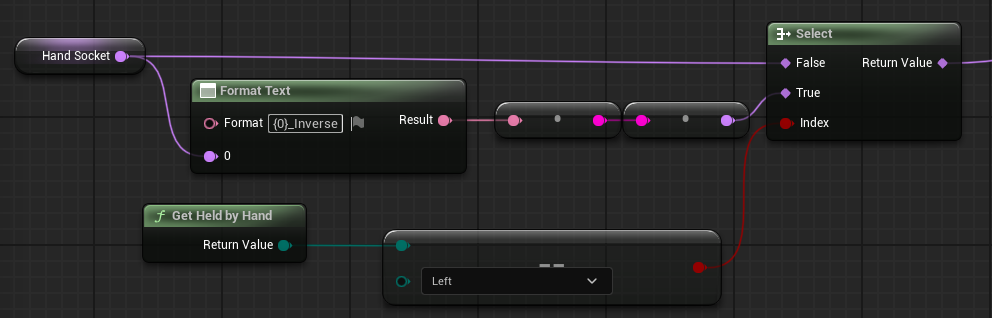
  - HandSocket Attach 네임 설정 설정하기

- [과제] 마켓 플레이스에서 총기 및 아이템을 들고와 원하는 모션을 구현해 봅시다.

### 4. 물체 충돌체크 

- 전방에 있는 물체 충돌체크하기
  - Function Library 만들기
  - 우선순위에 따라 전방에 있는 사물 인식하기
  - GrabComponent 에서 priority : integer 추가하기
  - VR_Function_Library 만들고 함수 추가하기
    - CanBePotentialTarget : 타겟을 잡을 수 있는 상태인지 확인하기
    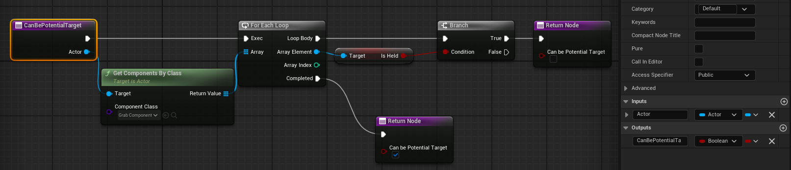
      - Actor를 불러와서 자식 Components들 중에서 Is Held 상태 확인하기
      - Held 상태가 아닌 경우 잡을 수 있는 상태로 반환하기
    - FindTopPrioGrabComponent : Grab Component 의 최 상위에 있는지 확인하기
    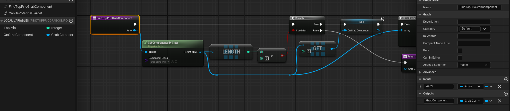
    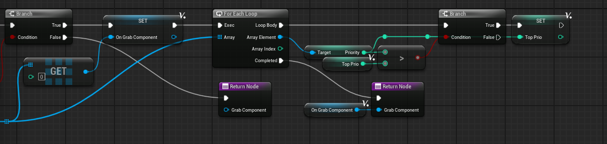
      - Actor를 불러와 자식 Components 들 중에서 GrabComponent가 있는지 확인하기
      - 우선순위를 매겨서 우선순위가 높은 컴포넌트 반환하기
  - VR Pawn 세팅하기
    - IA_Grab_Left_Preesed 에서 가까운 Controller를 찾았을 경우의 모든 내용을 함수화 하기
    - IA_Grab_Right_Preesed 에서 가까운 Controller를 찾았을 경우의 모든 내용을 함수화 하기
    - TraceAim : 전방에 있는 물체 충돌체크하기
    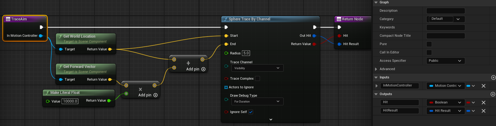
    - GetGrabComponentUnderAim : Aim으로 찾은 GrabComponent 상태 확인하기
    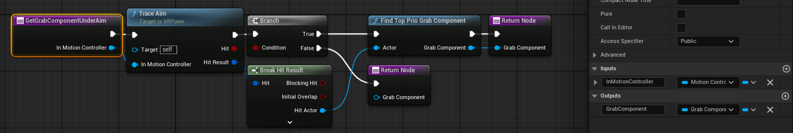
    - Motion Controller Left Aim - Get GrabComponent Under Aim과 연결하기
  
- 윤관선 만들기
  - M_Outline.uasset 다운로드 이후 Materials 인스턴스 만들기
    - PostProcessVolume 연결하기
    - PostProcessVolume - PostProcessMaterials 의 배열에 인스턴스 넣기
    - GrabComponent에 있는 StaticMesh 및 Skeletal Mesh의 Render CustomDepth Pass 를 이용하여 동작해보기
  - VR Pawn 윤곽선 관련 함수 빛 변수 추가하기
    - AimTargetGrapComponentLeft : Grab Component
    - AimTargetGramComponentRight : Grab Component
    - Mark For Grab 함수 : 윤곽선 상태 만들기
    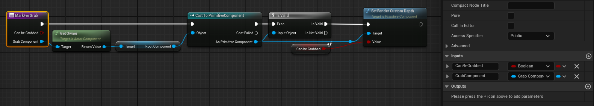
    - UpdateTargetGrabComponent
      - Sequence 설정하기
    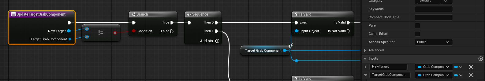
      - 타겟 Grab Component 윤곽선 해제하기
    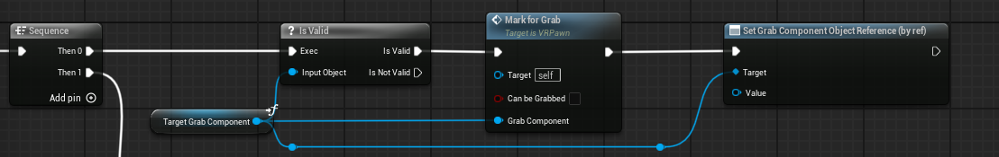
      - 타겟 Grab Component 윤곽선 설정하기
    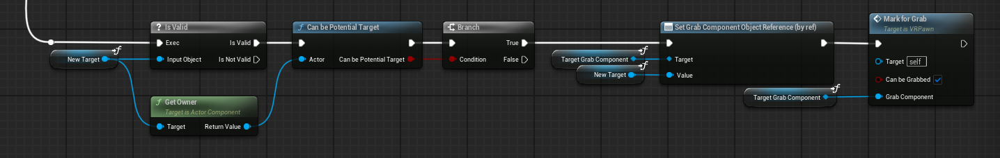
    - UpdatePotentialTarget : 전방에 있는 물체를 찾아서, 윤곽선을 만들어주는 함수 설정
    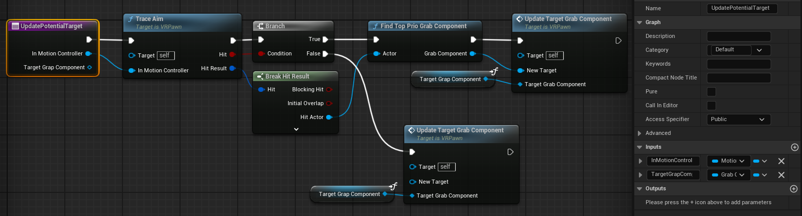
  - Tick 에 함수 적용하기
    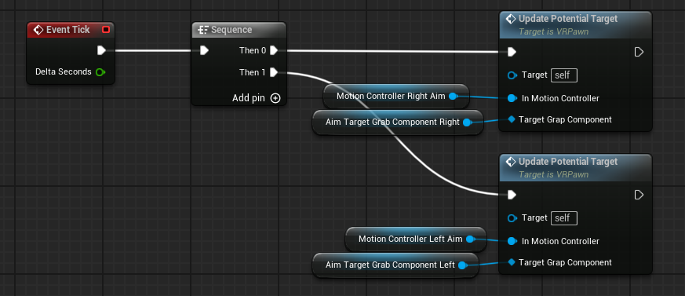

- 사물 끌어오기
  - GrabComponent 설정하기
    - bPulled : boolean 변수 만들기
    - TryPull : 끌어들이기 함수
    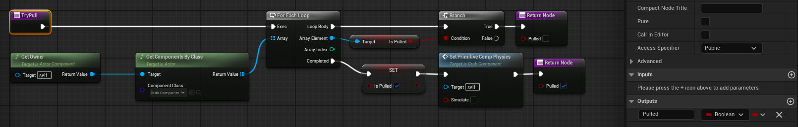
    - StopPull : 놓기 함수 - 
      - pull 가져오기
      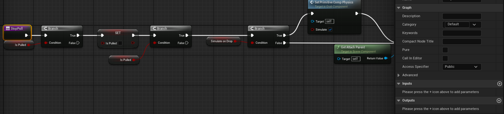
      - Release 에서 물리작용 내용 가져오기
      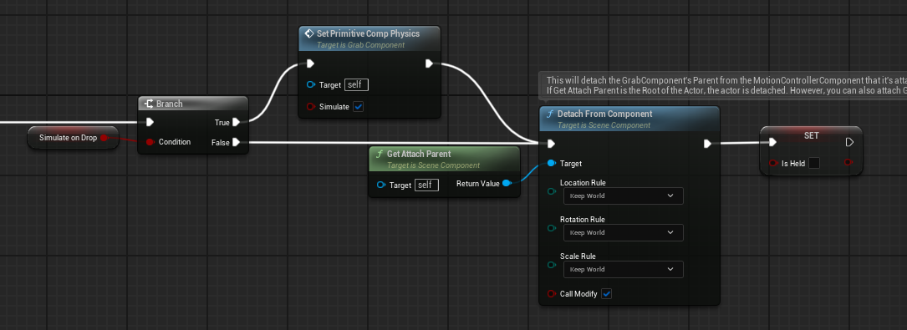
      - TryGrab - Sequence2 에서 세팅해주기
      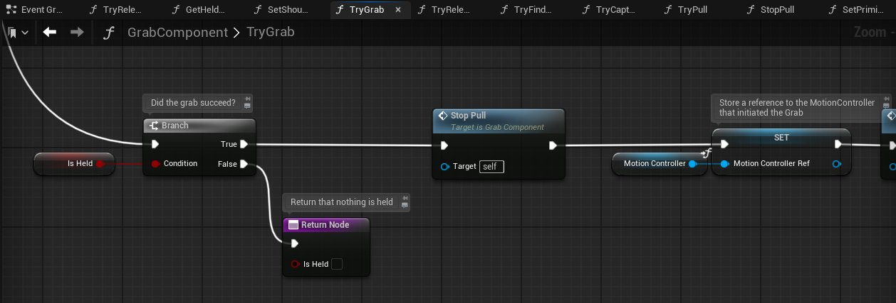

  - VRPawn에서 세팅하기
    - 두 변수 추가하기
      - PulledGrabComponentLeft : GrabComponent
      - PulledGrabComponentRight : GrabComponent

    - 충돌체크 테스트 부분에서 변수에 끌어들일 객체 저장하기
    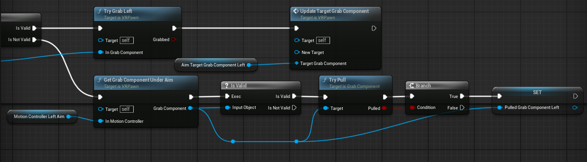

    - Release 설정하기
    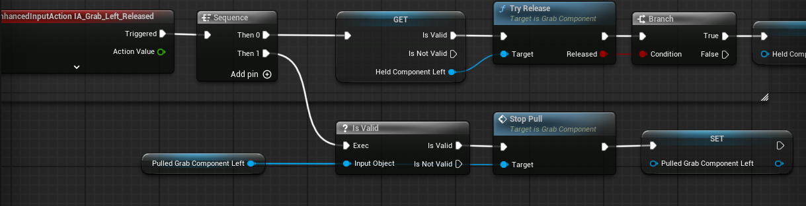

    - UpdatePulledObject 구현하기
    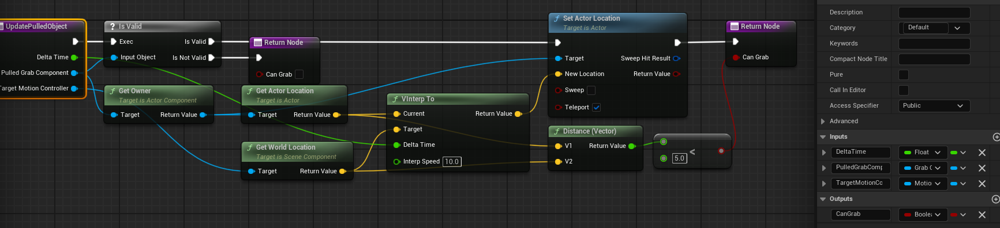
      - Actor (GetOwner - Actor Location)의 위치값과, 컨트롤러의 World Location을 Vinterp To 로 가까이 다가오게 하기
      - Set Actor Location 으로 위치값 조정하기
      - 거리 값 조정하여 특정 위치에서 잡을 수 있도록 세팅하기
      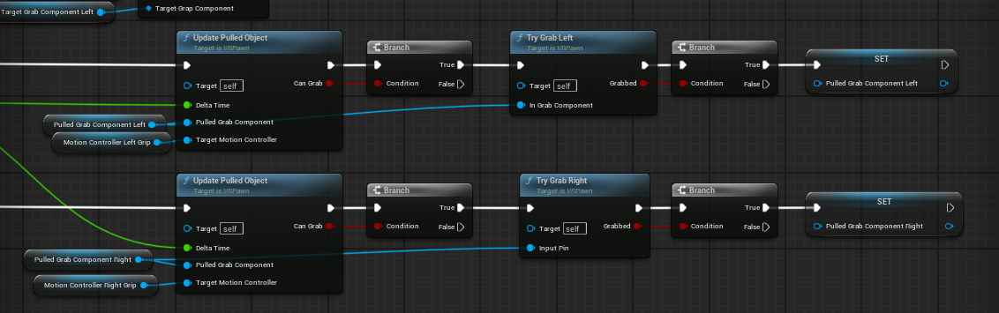
      - TryGrabRight/Left 에서 Return Node 세팅해주기
      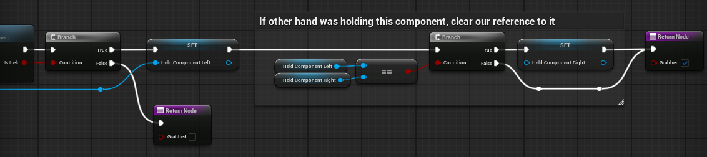
    
# 5. 기믹(Gimmick) 만들기

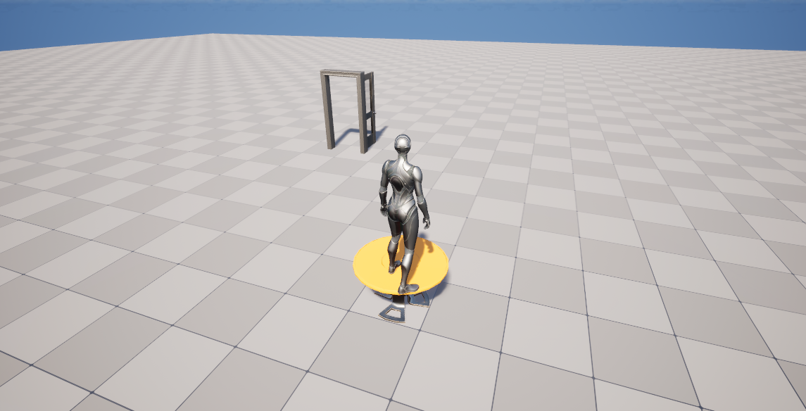

- 기믹 환경 만들어보기
  - BP_Door 구성하기
  - Static Mesh 설정하기 
  - TimeLine 만들기- 문에 대한 설정 조정하기
  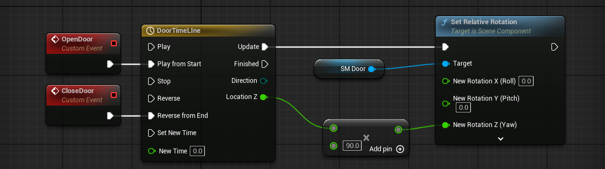

  - BP_Gimmick 만들기
    - IsComplete : boolean 변수만들기
    - Event Dispatcher 구성하기 : QuestComplete
    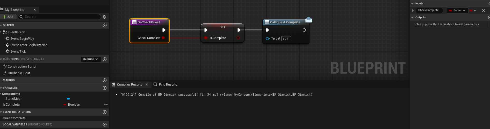 

  - BP_GimmickComponent 만들기
    - BP_Gimmick을 담고 있는 컴포넌트 생성하기
    - 컴포넌트에 있는 Complete 확인하여 클리어 구현하기
    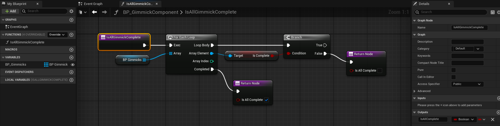

  - BP_Door에서 BP_GimmickComponent 연결하기
    - QuestComplete를 실행할 때마다 문이 열릴 수 있는 결과 확인하기
    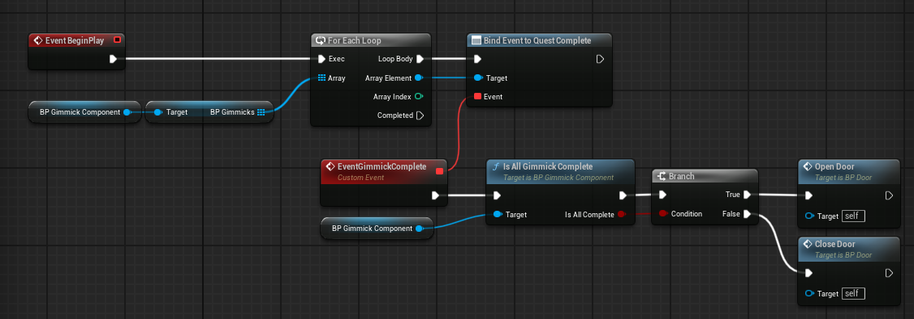

  - BP_SubGimmick
    - Box 만들고, Casting을 이용해 객체 필터링해서 OnCheckQuest 만들기
    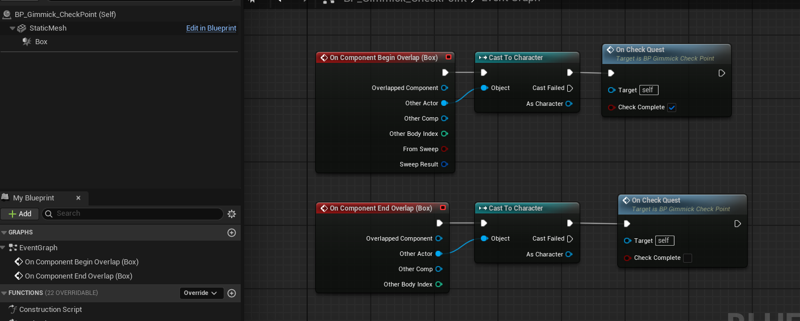

- Resources - Gimmicks 가져오기
  - 리소스 가져오기

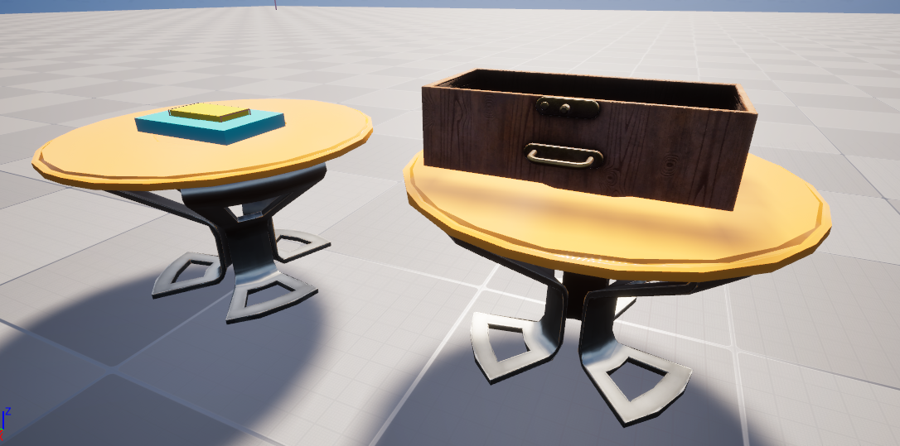

- 버튼 만들기
  - BP_Gimmick 자식으로 BP_PhysicsButton 생성
  - 컴포넌트 구성 - Button - Box Collision
  - BoxCollision[Collision Preset - OverlapAllDynamic]
  - OnComponentBeginOverlap / OnComponentOverlap
  - TimeLine 만들기
    - ButtonTimeline을 더블 클릭하여 Float Track 추가
    - Key 0: Time = 0.0, Value = 0.0
    - Key 1: Time = 0.1, Value = 1.0
  - Lerp(기본 위치, 눌린 위치, Timeline 값)
  - 변수 구성
    - InitialLocation : Vector
    - PressedOffset : Vector
  - Event Begin Play - Set InitialLocation = ButtonMesh.WorldLocation
  - OnComponentBeginOverlap (Box Collision)
    - Play (ButtonTimeline)
  - OnComponentEndOverlap (Box Collision)
    - Reverse (ButtonTimeline)
  - ButtonTimeline Update
    - Set ButtonMesh.WorldLocation = Lerp(InitialLocation, InitialLocation - (0,0,5), Timeline Alpha)
    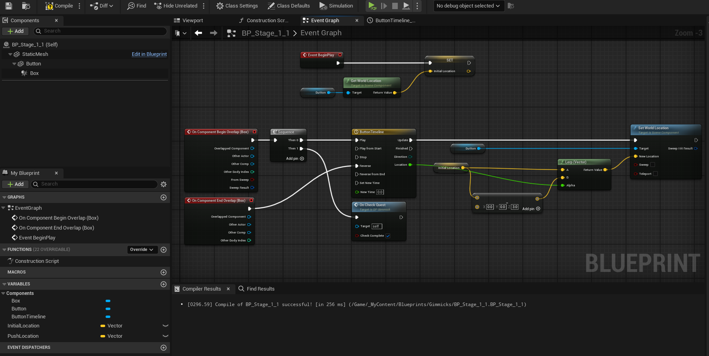

- 서랍 만들기
  - SkeletalMesh 만들기
  - 소켓 생성하기
  - SkeletalMesh - GrabComponent 세팅하기
  - 변수 만들기
    - Grabbed : boolean
    - GrabLocation : Vector
  - 초기값 세팅하기
  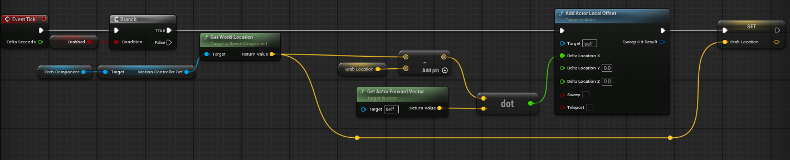
  - Grab 해서 내적을 통해 앞쪽으로 움직이는 손을 움직이기
  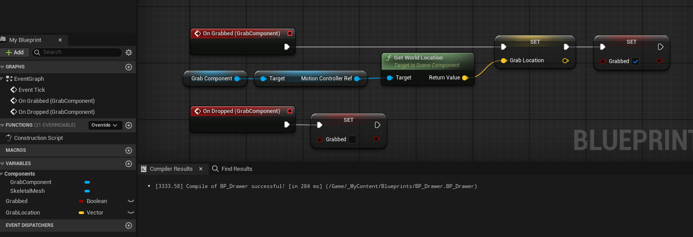
  - Widget을 이용하여 힌트만들기
  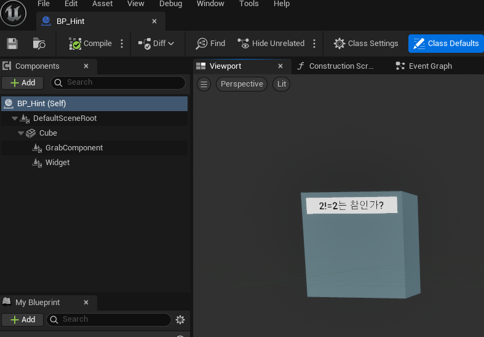

# 6. 인벤토리 만들기

- Widget 관리하기
  - UI 모드를 전환할 수 있는 Menu에서의 코드 가져오기
    - MotionController 변수 만들어주기
    - BeginPlay
    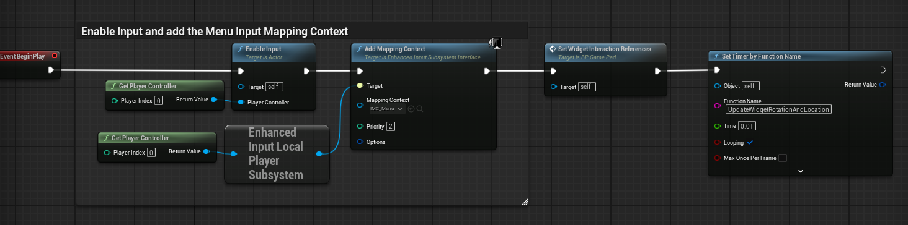
      - EnableInput
      - Add Mapping Context
      - SetWidget Interaction Reference
    - ClosePad
    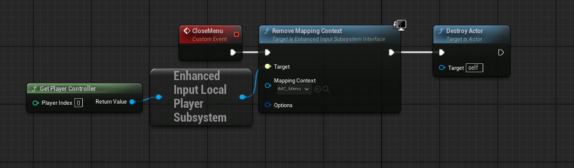
    - IA_Menu_Interact_[Left/Right]_Pressed
    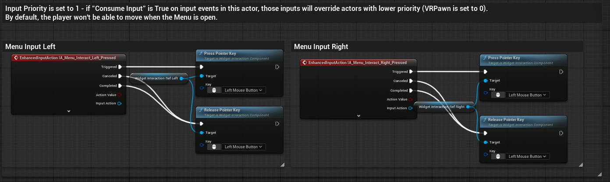
    - 지속적으로 플레이어를 바라보게 하기
    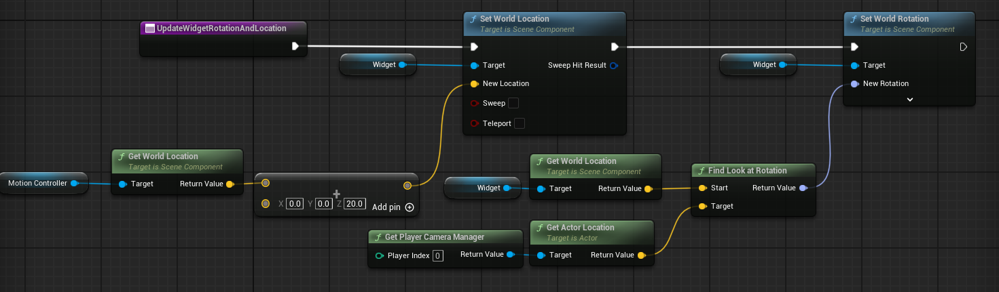
  - VRPawn에서 Toggle Menu 바꿔주기
    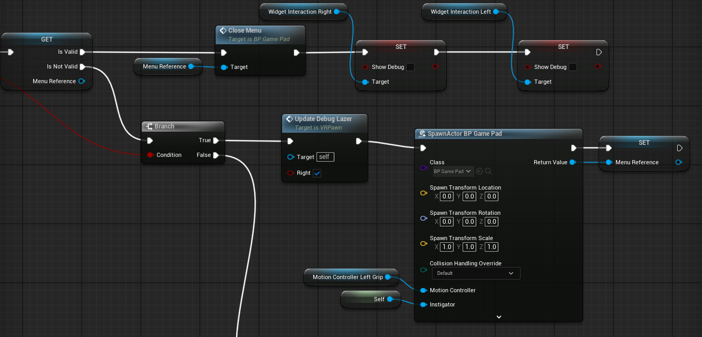
    - 오른쪽 왼쪽에 따른 구분 지어주기
    - Pad로 돌아와 Pad가 바라보는 방향 지정해주기
    - Pad 껐다 키면서 Show Debug 설정해주기
  - Password Widget 생성 이후, Password 입력 Gimmick 만들기
    - Widget 구성하기
    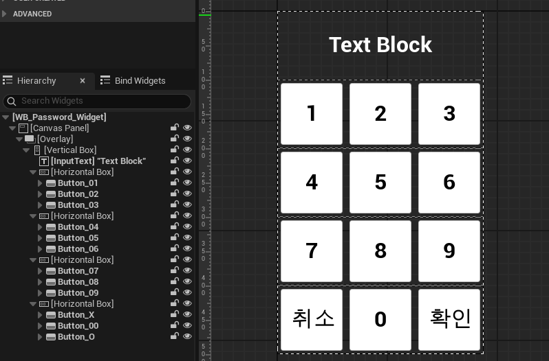
    - 버튼 구성하기
    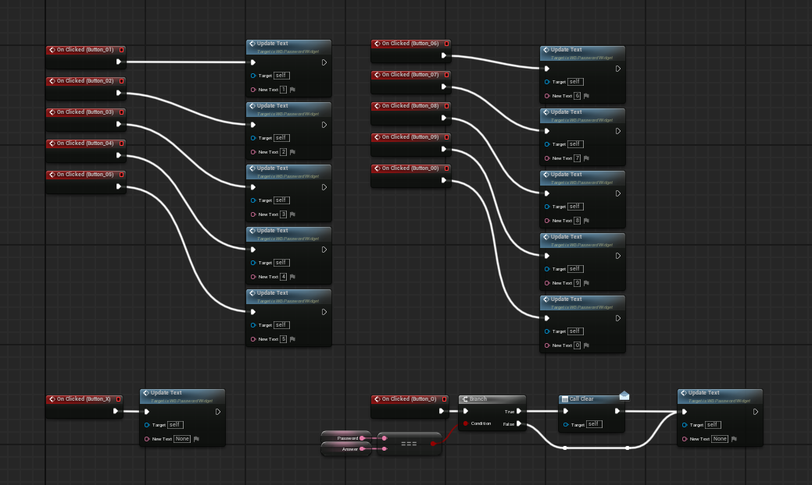
    - 텍스트 조정하는 함수 만들기
    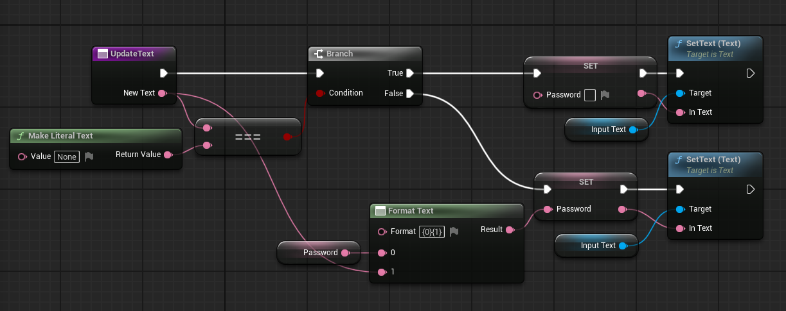
    - 형태 구성하기
    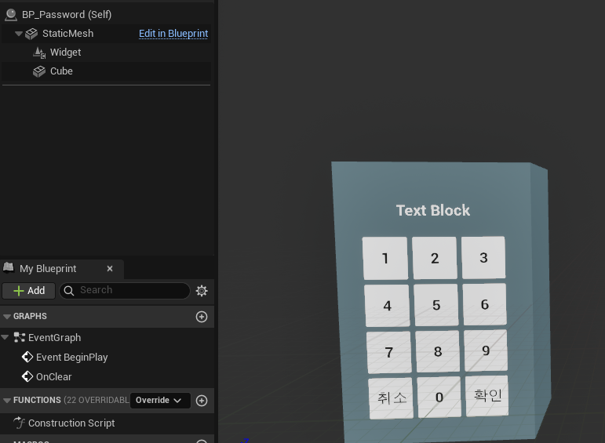
    - 디스패처 연결하기
    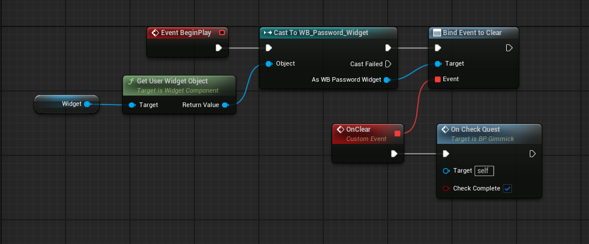

- 아이텝 집고 넣기
  - 현재 집고 있는 GrabComponent Actor 가져오기 및 세팅해주기
  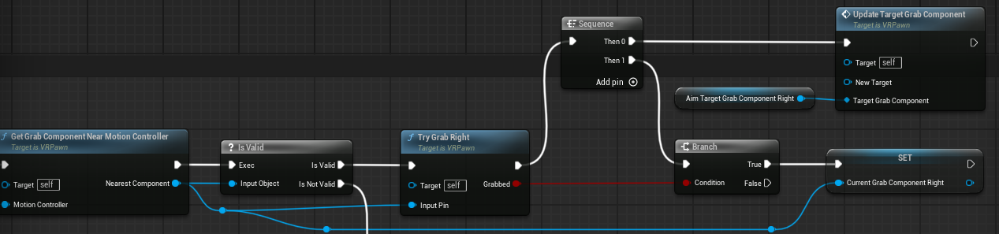
    - CurrentGrabComponentLeft : GrabComponent
    - CurrentGrabComponentLeft : GrabComponent
    - 변수 세팅해주기
    - 초기화도 해주기
    - Pulled도 세팅했기 때문에 같이 해주기
  - Input 추가하기
    - IA_Grab_Take_Left : A
    - IA_Grab_Take_Right : X 
    - Default에 넣어주기
  - GrabComponent에 아이템 타입 설정하기
    - E_ItemType
      - 아이템 타입
    - ST_ItemType
      - Name : String
      - Actor : Actor
      - type : E_ItemType
    - GrabComponent에 E_ItemType 변수 추가하기
  - BP_Inven_Component
    - Slot : ST_ItemType - Array
    - 아이템 추가하기 : AddItem
    - 아이템 삭제하기 : RemoveItem
  - VRPawn 세팅하기
    - TakeItem
    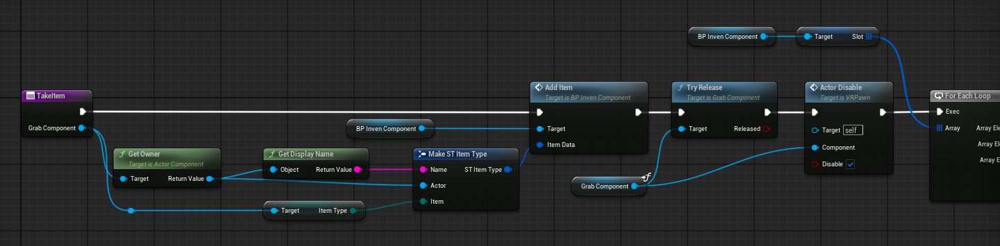
    - Actor Disable [삭제하지 않고, 어딘가에 보관해 놓기]
    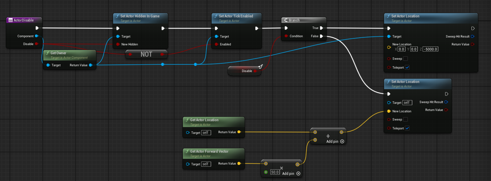